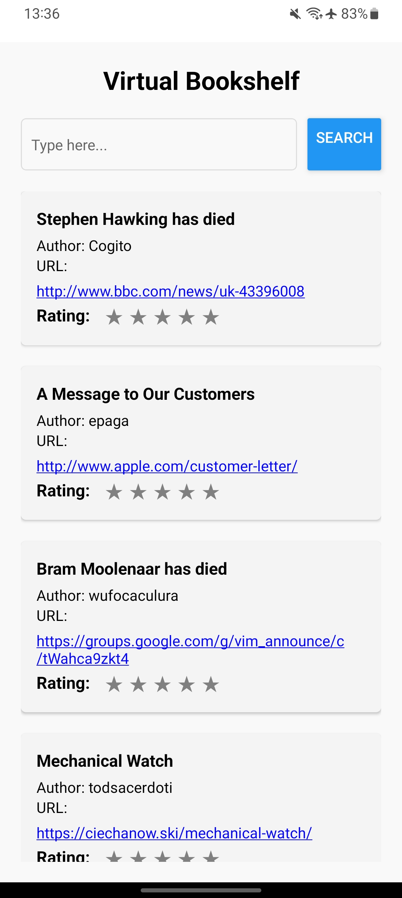

# Virtual Bookshelf

**Virtual Bookshelf** is a mobile application developed in React Native that allows users to search for books and rate them with a star rating system. The books are fetched using the API provided by `hn.algolia.com`.

## Features

1. **Search Bar**: Users can input a search key to find related books.
2. **Book Listing**: Search results are displayed in a list, showcasing the book's title, author, and URL.
3. **Star Rating**: Each book can be rated using a 1 to 5 star system.

## Prints
<p align="center">
  
   
  
</p>

## Installation

To run **Virtual Bookshelf** locally:

1. **Clone the Repository**:

   ```bash
   https://github.com/SauloCav/Virtual-Bookshelf-Reac-Native
   ```

2. **Install the Dependencies**:

   ```bash
   npm install
   ```

   or

   ```bash
   yarn install
   ```

## Project Structure

- `App.js`: The main component that renders the search bar and the book list.
- `SearchBar.js`: Component for the search bar.
- `BookItem.js`: Component to display each book item in the list.
- `Rating.js`: Component for the star rating system.

## Contribution

If you'd like to contribute to this project, feel free to create a pull request. I'll be happy to review and incorporate improvements.

## License

This project is licensed under the [MIT License](LICENSE).
